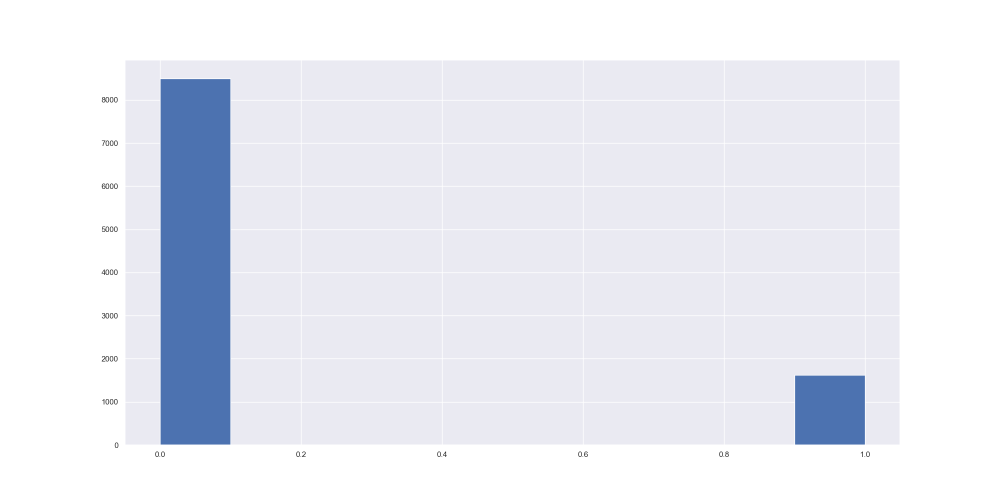

# Predict Customer Churn

This is a classification task to predict customer attrition. The data is taken from Kaggle [here] (https://www.kaggle.com/sakshigoyal7/credit-card-customers).

This is an imbalanced dataset. It was fun interpreting the accuracy, precision, and recall numbers.

## Running the code

Use the package manager [pip](https://pip.pypa.io/en/stable/) to install the following in a new environment.

```bash
conda create --name churn
pip install pandas numpy sklearn matplotlib pylint autopep8 pytest seaborn
```

## Usage

```bash
python3 churn_script_logging_and_tests.py

python3 -m pytest churn_script_logging_and_tests.py

```

## Results

### Exploratory Data Analysis

Age of customers


Churn ratio


Correlation of features


Marital Status ratio


Total transactions per customer


### Results

Random Forest Results


Logistic Regression Results


It is interesting to note that even if on average, logistic regression performs well, it performs particularly bad for class 1 i.e. for attritioned customers. We can see that the recall is particularly bad for class 1. This means that there is a very high number of False Negatives (As we can also see that precision is much better for class 1). The algorithm is misclassifying a lot of this class as the other class.

To read more about interpreting precision, recall, read [this] (https://medium.com/data-science-in-your-pocket/calculating-precision-recall-for-multi-class-classification-9055931ee229). 

Feature importance for Random Forest Classifier


## Contributing
Pull requests are welcome. For major changes, please open an issue first to discuss what you would like to change.

Please make sure to update tests as appropriate.

## License
[MIT](https://choosealicense.com/licenses/mit/)